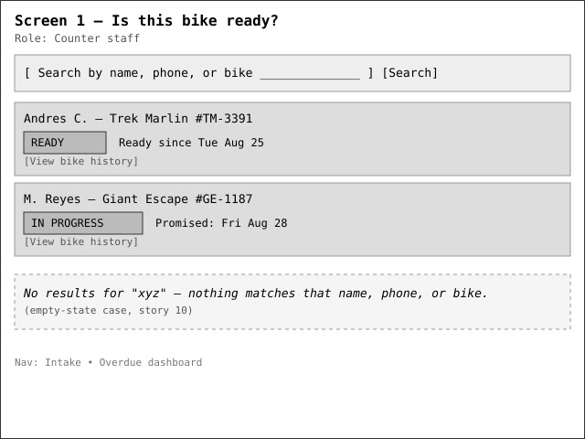
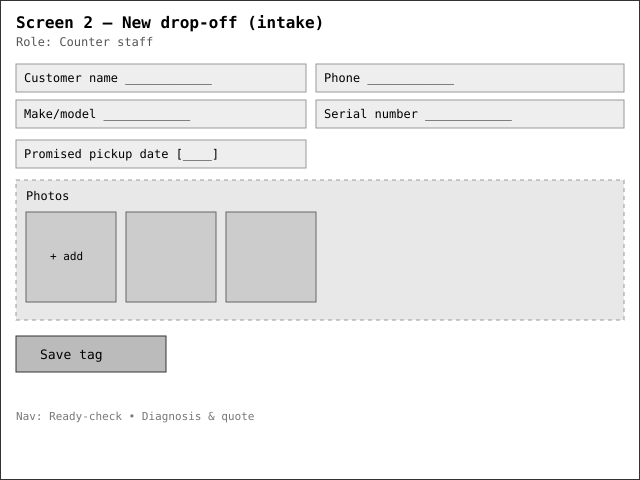
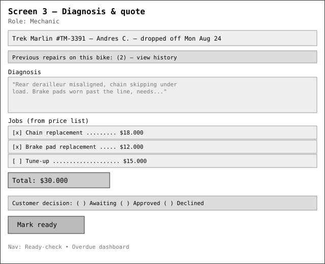
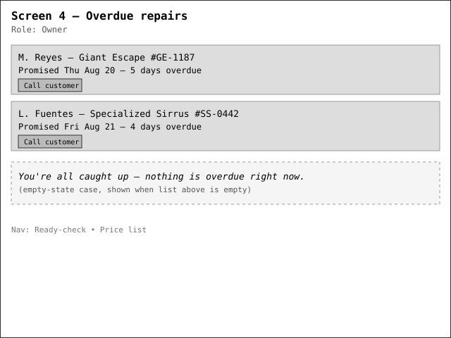
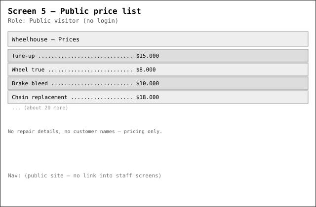
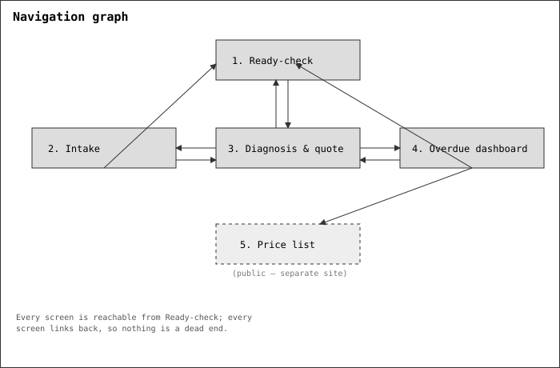

# Wireframes

Five screens, low fidelity, grey boxes. Colour, typography and finish are not the point here — the
layout and the navigation between screens are.

## 1. Is this bike ready? — Counter staff

This is the screen that answers the question the owner describes: a customer calls, and whoever
picks up the phone can answer immediately instead of walking to the back. Includes the empty-state
case (story 10) for a search that matches nothing.

## 2. New drop-off — Counter staff

Tag replacement: customer name and phone, bike identification, promised date, and intake photos.

## 3. Diagnosis & quote — Mechanic

Where a mechanic writes the diagnosis, builds the quote from the price list, and later records the
customer's decision. Also surfaces the bike's previous repairs, so a second owner — or a different
mechanic picking up where a colleague left off — can see them.

## 4. Overdue repairs — Owner

The screen the owner asked for directly: repairs past their promised day, visible before the
customer calls to complain. Includes its own empty state.

## 5. Public price list — Public visitor

The one thing made public, per the owner: prices only, nothing about any customer's repair.

## Navigation graph

Ready-check is the hub: every staff screen is reachable from it and links back to it, so nothing is
a dead end. The public price list is deliberately outside that graph — it's a separate, unauthenticated
site with no link into staff screens, matching "nothing else public."
